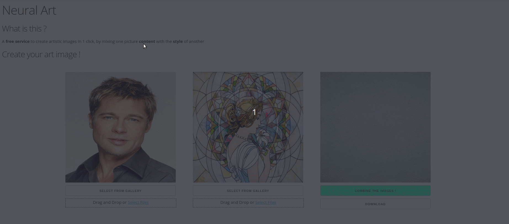

# Neural art

Minimal web application for creating artistic pictures through neural style transfer
(nst model from [tensorflow hub](https://tfhub.dev/google/lite-model/magenta/arbitrary-image-stylization-v1-256/int8/transfer/1))



## Setup

This app uses python 3.7. Install required packages as such, ideally in a dedicated environment:
```
pip install -r requirements.txt
```
Then run the following to download the NST model from tensorflow hub:
```
python setup.py
```

